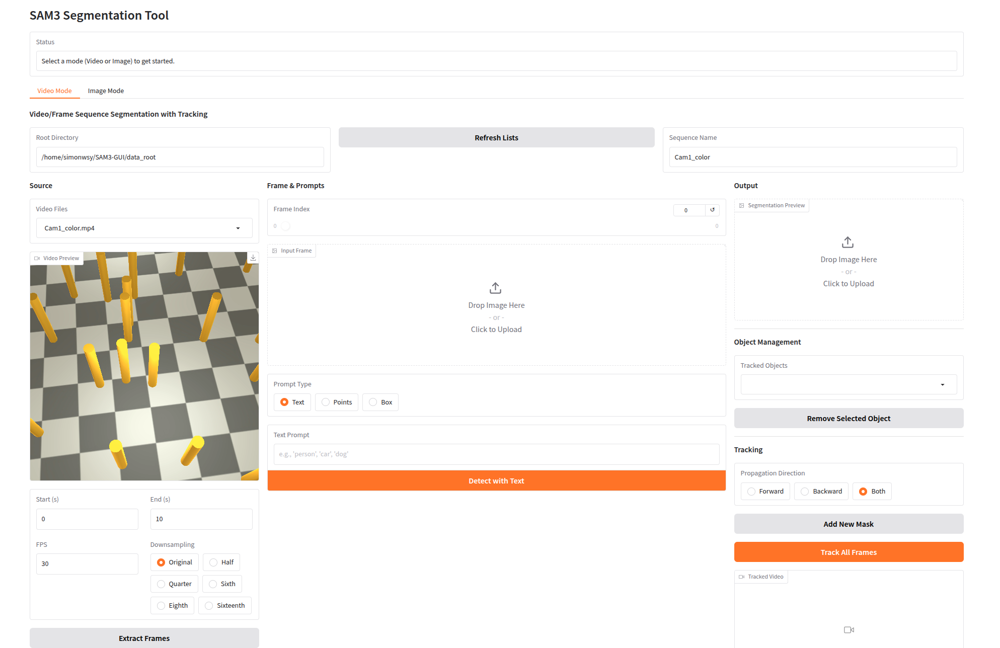
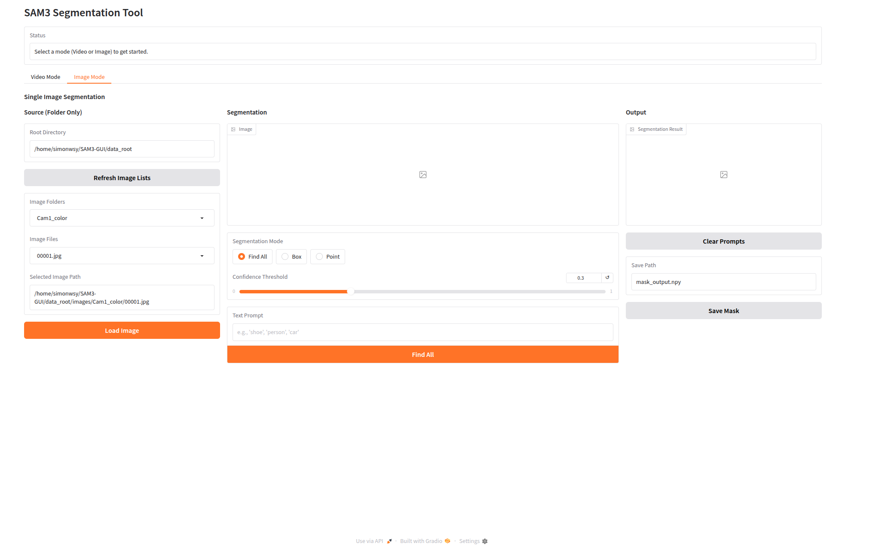

# SAM3 图形界面

[English](README.md) | **简体中文**

基于 **SAM3** (Segment Anything with Concepts) 的视频和图像分割图形界面工具，支持**开放词汇文本提示**。

## 主要功能

- **原生 SAM3 支持**: 基于 SAM3 构建，完全兼容 SAM3 API
- **文本提示**: 使用自然语言描述分割对象（例如"人"、"汽车"、"红鞋子"）
- **点选交互**: 使用正/负样本点进行交互式优化
- **框选提示**: 绘制边界框来分割对象
- **视频追踪**: 跨视频帧的多对象追踪，支持传播方向设置
- **多对象管理**: 使用"添加新掩码"功能独立追踪多个对象

## 安装

### 环境要求

- Python 3.12 或更高版本
- PyTorch 2.7 或更高版本
- 支持 CUDA 的 GPU，CUDA 12.6 或更高版本

### 1. 安装 SAM3

首先，安装 [SAM3](https://github.com/facebookresearch/sam3)：

```bash
# 创建新的 Conda 环境
conda create -n sam3 python=3.12
conda activate sam3

# 安装带 CUDA 支持的 PyTorch
pip install torch==2.7.0 torchvision torchaudio --index-url https://download.pytorch.org/whl/cu126

**Blackwell RTX 50X0 GPU 用户注意：** 这些 GPU 需要从源码编译 torchvision，因为目前尚无预编译的 wheel 包。

# 克隆仓库并安装包
git clone https://github.com/facebookresearch/sam3.git
cd sam3
pip install -e .

# 可选：安装示例笔记本或开发的额外依赖
# 用于运行示例笔记本
pip install -e ".[notebooks]"

# 用于开发
pip install -e ".[train,dev]"
```

### 2. 安装 GUI 依赖

```bash
cd SAM3-GUI
pip install -r requirements.txt
```

**注意：** 需要先安装 SAM3 才能使用 SAM3-GUI。

### 3. 下载 SAM3 模型

使用 ModelScope 下载 SAM3 模型检查点：

```bash
# 如果尚未安装 modelscope
pip install modelscope

# 下载模型（默认保存到 ~/sam3/model/sam3.pt）
python tools/download_model.py

# 或指定自定义输出目录
python tools/download_model.py --output_dir /path/to/model/dir
```

模型将从 [ModelScope](https://www.modelscope.cn/models/facebook/sam3) 下载，默认保存到 `~/sam3/model/sam3.pt`。

**替代方案：HuggingFace 认证（可选）**

如果你更喜欢使用 HuggingFace 或需要访问私有检查点：

```bash
huggingface-cli login
```

## 使用说明

### 启动 GUI

```bash
python cli.py --root_dir [数据根目录]
```

可选参数：
- `--port`: 端口号（默认：8890）
- `--server_name`: 服务器地址（默认：127.0.0.1；如需外部访问请使用 0.0.0.0）
- `--vid_name`: 视频子目录名称（默认："videos"）
- `--img_name`: 图像子目录名称（默认："images"）
- `--mask_name`: 掩码子目录名称（默认："masks"）

### 数据组织

按以下结构组织你的数据：

```
data_root/
├── videos/          # 用于提取帧的 MP4 文件
│   ├── seq1.mp4
│   └── seq2.mp4
├── images/          # 预提取的帧序列
│   ├── seq1/
│   │   ├── frame_00000.png
│   │   ├── frame_00001.png
│   │   └── ...
│   └── seq2/
│       └── ...
└── masks/           # 保存掩码的输出目录
    ├── seq1/
    │   ├── frame_00000.png
    │   ├── frame_00000.npy
    │   └── ...
    └── seq2/
```

## 视频模式工作流程

### 1. 加载帧

- **选项 A**：选择视频文件并提取帧
  - 从下拉菜单选择视频
  - 设置开始/结束时间、FPS 和高度
  - 点击"提取帧"

- **选项 B**：加载预提取的帧
  - 从下拉菜单选择帧文件夹
  - 点击"加载所选帧"

### 2. 添加提示

从三种提示类型中选择：

#### **文本提示**
1. 输入文本描述（例如"人"、"汽车"、"红衬衫"）
2. 点击"使用文本检测"
3. 使用"添加新掩码"来分割更多对象

#### **点提示**
1. 点击"+ 正样本"添加包含点（绿色）
2. 点击"- 负样本"添加排除点（红色）
3. 在**输出图像**上点击放置点
4. 点是帧特定的 - 切换帧以在其他帧上添加点
5. 查看"已添加点"表格了解所有帧上的点

#### **框提示**
1. 点击"框选分割"
2. 在帧上点击两个角点绘制框
3. 框内的对象将被分割

### 3. 管理对象

- **查看追踪对象**：下拉菜单显示所有检测到的对象（0、1、2、...）
- **移除对象**：选择对象并点击"移除所选对象"

### 4. 视频追踪

1. 选择传播方向：
   - **向前**：从当前帧传播到结尾
   - **向后**：从当前帧传播到开头
   - **双向**：向两个方向传播（默认）

2. 点击"追踪所有帧"
3. 查看追踪视频输出
4. 使用帧滑块查看单个帧的结果

### 5. 保存掩码

- 掩码保存路径自动生成：`{root_dir}/masks/{sequence_name}/`
- 点击"保存掩码"将掩码导出为 PNG 和 NPZ 文件

## 图像模式工作流程

单图像分割，提供三种模式：

### **查找全部模式**
1. 输入文本提示（例如"鞋子"、"人"、"汽车"）
2. 调整置信度阈值（0.0-1.0）
3. 点击"查找全部"检测所有匹配的对象

### **框选模式**
1. 点击"框选分割"
2. 在图像上点击两个角点绘制框
3. 框内的对象将被分割

### **点选模式**
1. 点击"+ 正样本"或"- 负样本"
2. 在图像上点击放置点
3. 使用"按索引移除点"删除特定点

## 致谢

本应用基于 [shape-of-motion](https://github.com/vye16/shape-of-motion/) 修改，从 SAM2 升级到 SAM3 并添加了文本提示支持。




